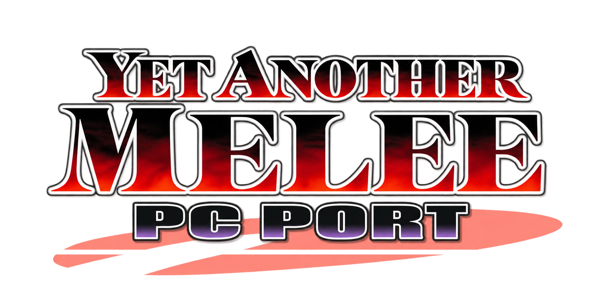
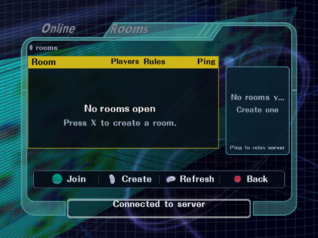
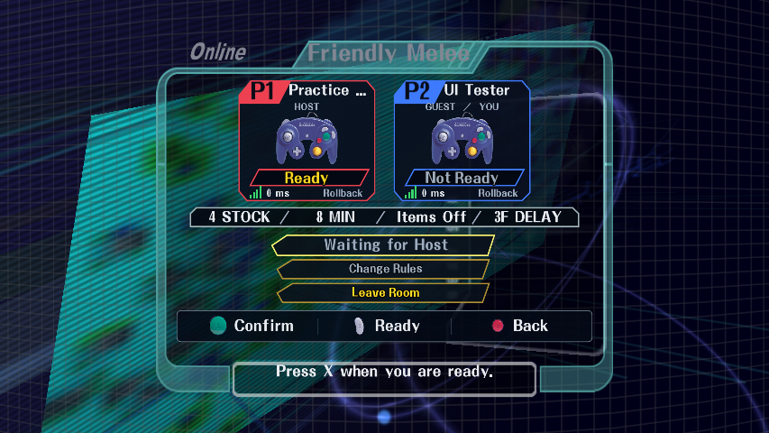
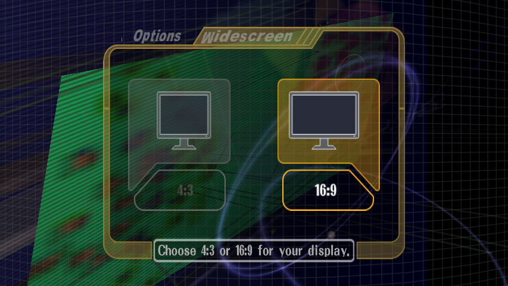
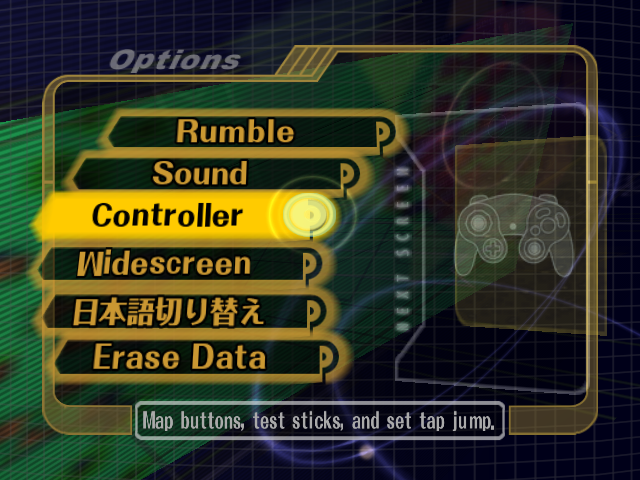
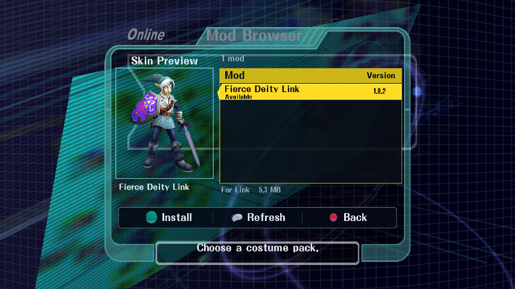
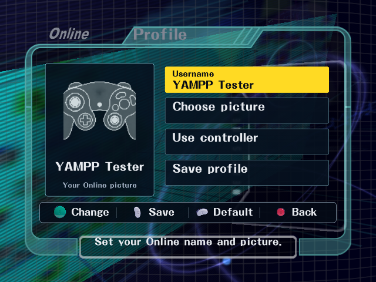
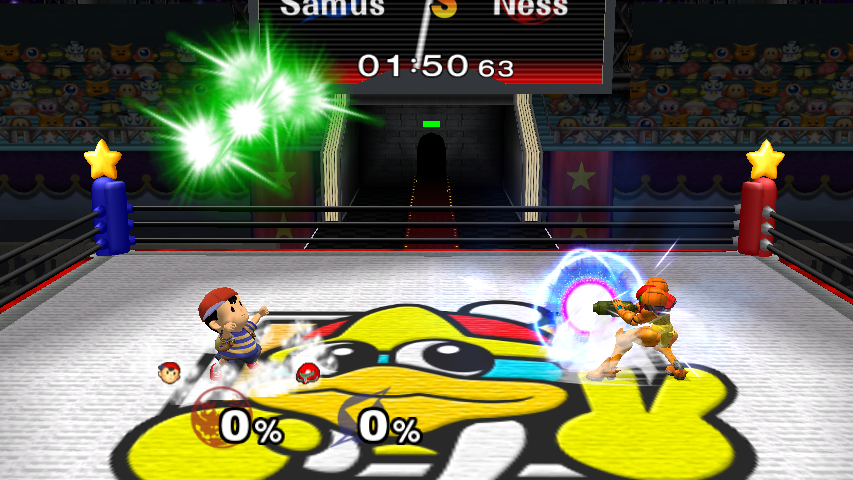
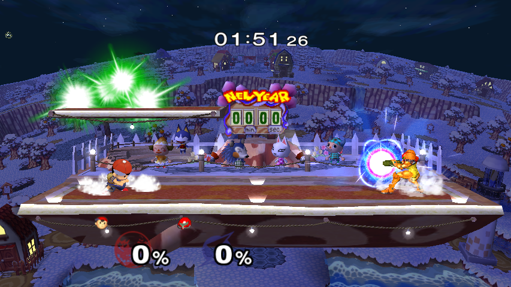

# Yet Another Melee PC Port (YAMPP)

YAMPP is an experimental PC port of Super Smash Bros. Melee USA 1.02, based on the [Melee decompilation](https://github.com/doldecomp/melee), with a native PC runtime and Aurora graphics. The tested play build targets Windows; experimental native Linux build support is also included. Melee Workshop provides local fighter, stage and texture editing.

Supply your own **NTSC-U 1.02 / GALE01 revision 2** disc image. This source tree and the distribution contain no disc images, extracted game files, installed mods or memory cards. First-run setup extracts your image locally. Original game art, fonts, models, music and animations remain Nintendo/HAL Laboratory's work.

## Play

**[Download the Windows release](https://github.com/sonsegajp/YAMPP/releases/latest)** and extract the entire ZIP. The distribution starts with **Play YAMPP.cmd** and follows the original opening FMV to the title screen; A/Start skips the movie. **Setup.cmd** selects and validates your disc. **Melee Workshop.cmd** opens the editor. Source checkouts retain only the normal **Run-Melee.cmd** and **Run-Workshop.cmd** launchers; test utilities are under `scripts/`. See [setup and building](docs/building.md).

Keyboard defaults: WASD = main stick, X = A, Z = B, C/V = X/Y, Enter = Start, Q/E = L/R, Shift = Z, IJKL = C-stick, arrow keys = D-pad. SDL gamepads are supported. F1 opens PC settings.

- **Online** contains the room browser, **Mod Browser**, and **Profile**. Profile edits your username and a local picture; see the [tester notes](docs/tester-build.md) for current sharing limits. Create a room, type a room name, confirm it, choose rules and wait for everyone to become ready. See [Online controls and protocol](docs/netplay.md).
- Online play uses rollback during matches and synchronized inputs through character select, stage select and results. Peers check build, base-game data and exact costume package hashes. These checks reduce known sources of divergence; they are not a guarantee against every desync or a cheat-prevention system. See [compatibility](docs/netplay-compatibility.md) and [test evidence](docs/netplay-validation.md).
- Costume packs add slots after stock colors. Multiple packs use stable package identities and deterministic ordering. Joining a modded room asks before downloading and activating its exact required pack set. Gameplay-changing fighter/stage/Lua mods are currently outside the Online publishing contract.
- Optional Akaneia fighters, stages and music can be enabled in **Mod Manager** (X from Mod Browser). Room joins prompt before acquiring required content directly from the official GitHub release. Content reload preserves the application window. See [Akaneia evidence and limits](docs/akaneia-testing.md).
- Options includes **Controller** (mapping, input visualization and tap jump) and **Widescreen**, with 4:3 and 16:9 choices. Character select uses static portraits; the experimental live 3D previews have been removed.
- All original fighters are available. Local custom stage music is supported; Online uses original music to preserve the same guest execution path.

## Create

Start with the [modding guide](docs/modding.md): additive costumes and their artwork, fighter clones and Lua, stage imports, validation and Workshop publishing. [Custom music](docs/custom-music.md) documents folders, decoding and limits. [How YAMPP works](docs/architecture.md) explains the decompilation basis, native runtime, rendering, rollback and content isolation.

## Screenshots

Actual in-game Options and Online screens. More aspect ratios, dialogs and C-stick views are in the [UI gallery](docs/screenshots/README.md).

| Online rooms | Two-player lobby |
| --- | --- |
|  |  |
| **Widescreen options** | **Controller option** |
|  |  |
| **Mod Browser** | **Profile** |
|  |  |

## Akaneia compatibility

YAMPP supports the official **Akaneia 1.0.1** fighters, stages and music. **Akaneia is not included in YAMPP, this repository, or our server.** Download the official archive yourself, place it in `user/imports`, then install through Mod Browser. Follow the [step-by-step Akaneia installation guide](docs/akaneia-install.md). Room joins can separately offer a confirmed download directly from official GitHub.

These are compatibility screenshots of locally installed third-party content:

| Dedede / Boxing Ring arena | Village |
| --- | --- |
|  |  |

Source and build dependencies are credited in [CREDITS.md](CREDITS.md). Their licenses remain attached to their source and are collected with local distributions. The project is unofficial and is not affiliated with Nintendo.

## Current status

This is the public YAMPP source repository. Windows is the tested platform; Linux currently has compile validation, with hardware gameplay still unverified. The latest update fixes Akaneia music decoder corruption and missing stage dependencies, corrects distant ReDead palettes, and improves four-player performance. See [audio checks](docs/audio-validation.md), [rendering checks](docs/rendering-validation.md), [performance results](docs/performance-validation.md), and [tester notes](docs/tester-build.md).

Online room joining, required-content confirmation, same-window content activation, results and rematches have been exercised with impaired connections and rollback. These checks cover specific scenes and builds; they do not guarantee every mod, stage, controller or connection. Profile pictures are local for this tester. Occasional long-load audio gaps remain.

Windows preview downloads include the runtime, setup tools, Workshop and the selective content importer. Akaneia itself is acquired separately from its official GitHub release after confirmation. This source repository includes YAMPP's importer bridge and dependency references, not upstream mod content. Build instructions, dependency notices and [release notes](docs/releases/2026-09-20.md) are included; no blanket relicensing of dependencies is implied.

[Report a bug](https://github.com/sonsegajp/YAMPP/issues) with your build, operating system, active mods, stage/fighters and reproduction steps. Do not attach disc images, extracted game files, mods you cannot redistribute, saves or credentials.
