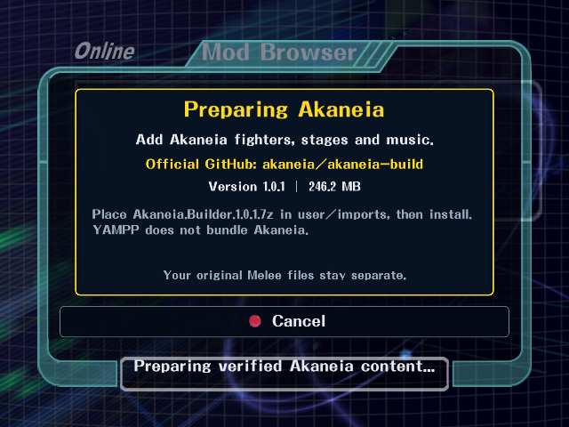

# Installing Akaneia in YAMPP

Applies to **v0.1.0 and later**.

YAMPP supports Akaneia; it does not distribute it. The Windows preview includes an importer, not the mod, a prepatched disc or its assets. Akaneia remains the work of the Akaneia team. This YAMPP release supports the pinned official **Akaneia 1.0.1** release.

## First installation

1. Extract the entire YAMPP Windows release and run **Setup.cmd** with your own original Melee NTSC-U 1.02 / GALE01 revision 2 image. For Akaneia import, select the original uncompressed ISO; do not supply a prepatched Akaneia image.
2. Visit the [official Akaneia 1.0.1 release](https://github.com/akaneia/akaneia-build/releases/tag/1.0.1) and download **Akaneia.Builder.1.0.1.7z** from its Assets list.
3. Place the unmodified archive at **`user/imports/Akaneia.Builder.1.0.1.7z`** inside your YAMPP folder. Create `user/imports` if updating an older build. Keep the archive compressed; do not rename it or copy its files over YAMPP's extracted game data.
4. Run **Play YAMPP.cmd**. Open **Online > Mod Browser**, select **Akaneia**, press **A**, then confirm **Install**. With the default keyboard mapping, **X on the keyboard is GameCube A**.
5. Wait for verification and preparation to finish. YAMPP verifies the official archive, applies it to your own verified base ISO in a separate local workspace, and imports the supported fighters, stages and music. Internet access is used for small pinned upstream metadata files; the initial archive must already be in your import folder. Allow several minutes and at least 8 GB of free working space beyond your original disc and YAMPP installation.
6. The menu reloads in the same window. From Mod Browser, press **GameCube X** (keyboard **C**) to open **Mod Manager** and check that Akaneia is enabled. Its added fighters and stage page are then available.

The initial Install action will not fetch a missing archive. If it is missing or does not match the supported release, the game reports an error and leaves your original game data intact.

## Enabling, disabling and older tester installs

Leave any Online room or match, open **Online > Mod Browser**, press **GameCube X** for **Mod Manager**, select Akaneia and press **A** to toggle it. The game reloads its content in the same window. Disable it to return to original Melee content; the local installation is retained.

If you used an older local tester, disable and re-enable Akaneia once. This rebuilds old imports with all 51 stage files, including the arena title table and Village scenery. A previously verified archive in YAMPP's cache can be reused; otherwise place the official archive in `user/imports` again.

## Joining an Online room

If the host requires Akaneia and you do not have matching content active, YAMPP prompts before downloading or enabling it. **Only this confirmed room-join flow may download a missing archive automatically**, directly from the official Akaneia GitHub release. Choosing Cancel leaves your content selection unchanged. YAMPP never mirrors Akaneia on its server.

After verification and import, YAMPP reloads the matching content and retries that room. Both players need the same YAMPP build, verified content and required costume packs. A room using original Melee offers to disable Akaneia before joining.

## Included support

The selective importer brings over seven added fighters, 17 versus arenas, seven target stages and 41 music tracks. It retains YAMPP's original menus and rules. Volleyball, other modes and unrelated Akaneia menu/code changes are excluded. Arbitrary `.mexproj` files or different Akaneia releases are not supported by this pinned installer.

See [compatibility screenshots and checks](akaneia-testing.md) and [credits](../CREDITS.md).

## Import failure recovery

Updated importer builds use shared read-only access to the original ISO, so
installation can run from the game while the disc is in use. Local archives
and verified cached archives are accepted after preparation; neither requires
a new GitHub download. The importer checks for at least 6 GB free before
preparation; 8 GB remains the recommended working allowance.

A failed attempt retains `prepare.log` under
`build/akaneia-content/import-*` and removes its disposable files. Successful
preparation retains the installed content and log while removing temporary
copies. The original archive in `user/imports` is retained. Attempts made with
older releases may still occupy space in their earlier import directories.
Disk-space errors now have a specific message instead of being reported as
GitHub verification failures.
