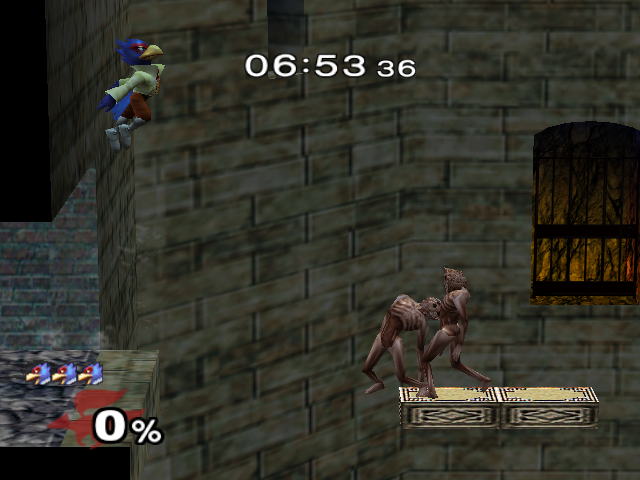

# ReDead palette correction - September 20, 2026

The distant Adventure ReDead was mottled green/purple while the original game rendered its brown skin. The same defect remained with fog disabled. Original ReDead texture descriptors have no mip chain, so a mipmap workaround was not justified.

A capture of the original game in Dolphin supplied a brown reference. The native texture and palette bytes were then compared against the actual enemy article in ItCo.usd: all ten distinct indexed textures and their first sixteen RGB565 palette colors matched the original archive. A RenderDoc capture showed those uploaded colors had instead been interpreted as RGB5A3.

GX stores the palette interpretation in each texture unit. The host translator previously attached it to a shared palette object keyed only by TMEM address. Scanning another stale texture unit using the same address with RGB5A3 could change the interpretation needed by the live RGB565 unit. Each of the eight texture units now receives its own Aurora palette view over the same immutable source bytes. Palette reloads update the corresponding views; unchanged bytes/bindings still reuse snapshots.

The new production-translator regression reproduces the old collision (same output palette slot for two formats), passes after the correction, and verifies both views receive fresh versions after a palette reload. The full gx_translate test program passes. The corrected native Adventure run reaches visible Underground Maze and exits after 3,800 frames without assertion/fault. Its distant ReDead is visibly brown and textured at the same corridor where the old output was green/purple. This does not establish complete Adventure progression or all game assets.

Local evidence: `build/texture-investigation/redead-palette-comparison.json`, `build/renderdoc/redead-distance_frame2740.rdc`, and `build/comparisons/maze-palette-fixed/report.json`. Diagnostic raw model/texture extracts remain ignored build artifacts and are not distributed.
