# Native UI screenshots

Actual YAMPP native runtime captures, reviewed on 19 September 2026. The screens use Melee's original animated menu background, frames and fonts. Click an image to open it at its captured resolution.

| Screen | 4:3 | 16:9 |
| --- | --- | --- |
| Main menu | [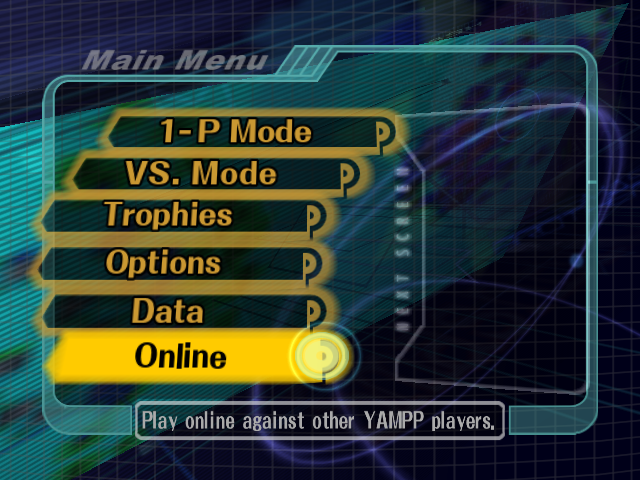](main-menu-4x3.png) | [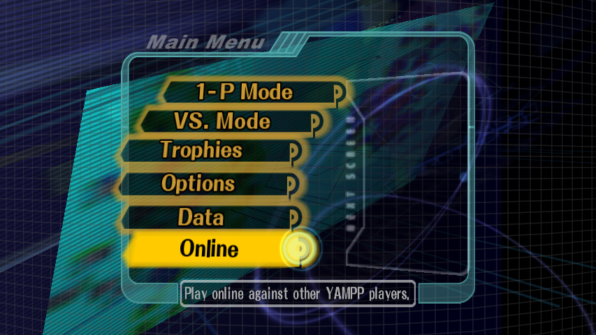](main-menu-16x9.png) |
| Online submenu | [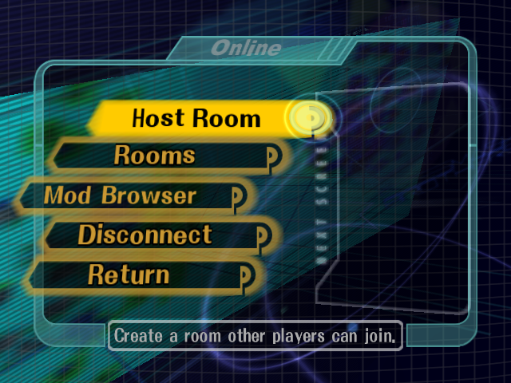](online-menu-4x3.png) | [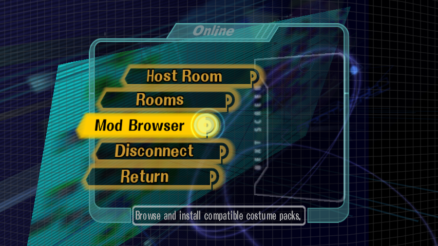](online-menu-16x9.png) |
| Room browser | [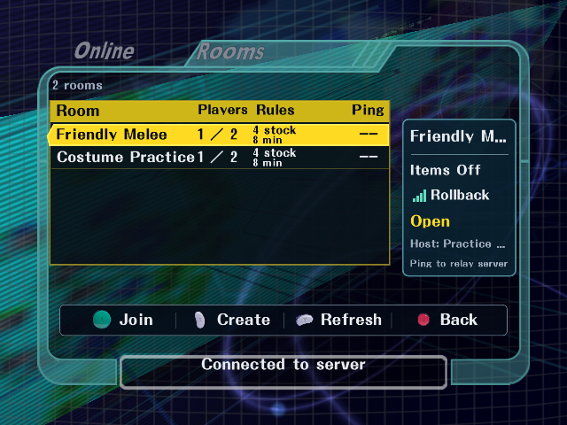](room-browser-4x3.png) | [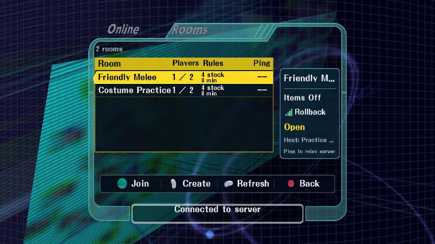](room-browser-16x9.png) |
| Typed room name | [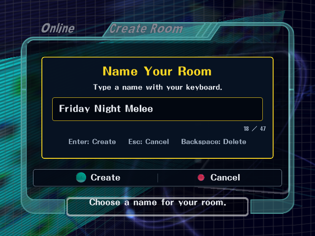](room-name-4x3.png) | [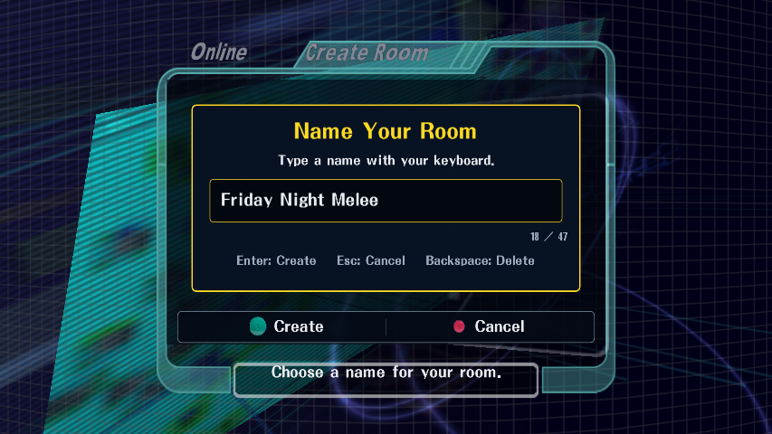](room-name-16x9.png) |
| Two-player lobby | [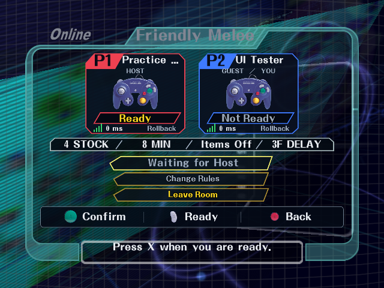](room-lobby-4x3.png) |  |
| Host lobby | [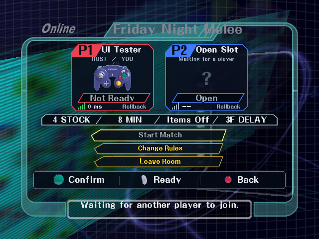](host-lobby-4x3.png) | [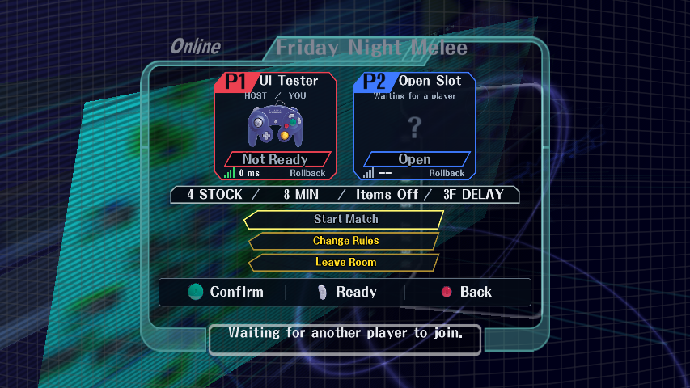](host-lobby-16x9.png) |
| Room rules | [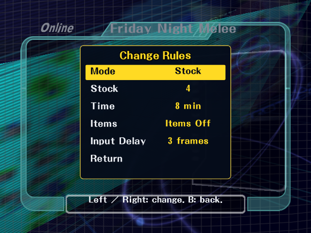](room-rules-4x3.png) | [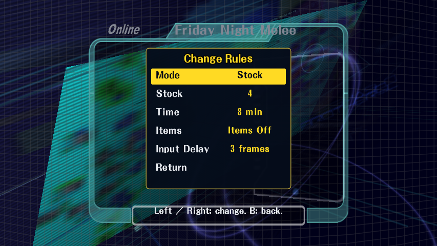](room-rules-16x9.png) |
| Mod Browser / static preview | [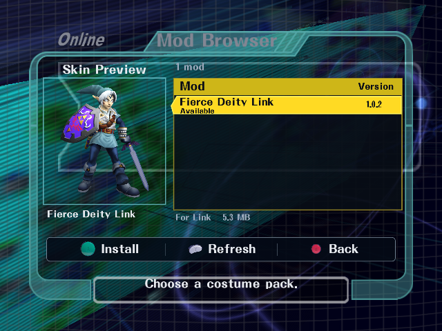](mod-browser-4x3.png) |  |
| Download confirmation | [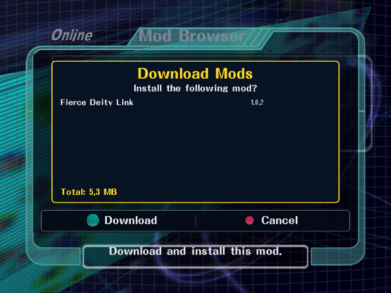](mod-download-4x3.png) | [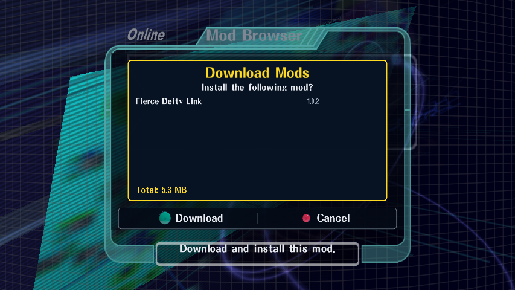](mod-download-16x9.png) |
| Aspect-ratio options | [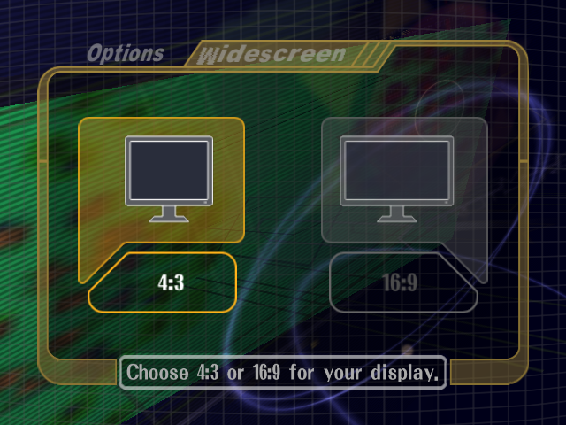](aspect-options-4x3.png) |  |

## Latest tester additions

[Clean portable build connected to the public room browser](room-browser-tester-r2.png).

[Controller hover on the native panel](controller-hover-20260919.png) and [saved local Profile](profile-20260919.png) were captured with the new tester pair. Earlier Online images in the table predate its sixth Profile row. Profile pictures remain local on the public service for this build.

## C-stick motion

The foreground, button glyphs, preview image and monitors follow the original menu camera and option-box animation.

| Screen | 4:3 | 16:9 |
| --- | --- | --- |
| Room browser | [Rotated view](room-browser-cstick-4x3.png) | [Rotated view](room-browser-cstick-16x9.png) |
| Room-name dialog | [Rotated view](room-name-cstick-4x3.png) | [Rotated view](room-name-cstick-16x9.png) |
| Mod Browser | [Rotated view](mod-browser-cstick-4x3.png) | [Rotated view](mod-browser-cstick-16x9.png) |
| Aspect options | [Rotated view](aspect-options-cstick-4x3.png) | [Rotated view](aspect-options-cstick-16x9.png) |

## Additional checks

- All five Online rows remain visible [offline](online-offline-4x3.png), [after disconnecting](online-after-disconnect-4x3.png), and [after reconnecting](online-menu-4x3.png). Selecting Rooms while offline connects and opens the browser.
- Real keyboard text, Backspace and Enter created the exact requested room name. Controller B canceled without creating a room.
- The [47-character input](room-name-47-characters.png) keeps its last characters and caret visible. The [long lobby title](room-name-long-lobby.png) stays inside the frame.
- Returning to the original 1-P menu restores its native hover illustration: [4:3](stock-menu-restored-4x3.png), [16:9](stock-menu-restored-16x9.png).
- Both aspect selections were saved correctly; monitor entrance, exit, selection and C-stick motion were checked.
- Mod Browser screenshots select Fierce Deity Link 1.0.2 and show its verified clean character render. Its four costume colors now include matching static CSS portraits and stock icons. The artwork was rendered from the corrected native models, posed against the original Link reference. Download confirmation was canceled.
- The final Mod Browser captures verify both aspect ratios after matching the overlay to the native 320:219 menu camera projection. Text, artwork, glyphs and prompts remain inside the cyan frame and follow C-stick motion together.

Captured with `scripts/check_online_native_ui.py` using isolated cards, settings, mod registries and local room fixtures. The final Mod Browser, its C-stick views and download confirmations use `yampp-four-player-final.exe` with the corrected `melee_aurora_wide.dll` and an isolated local fixture containing the exact 1.0.2 package. The 16:9 room browser, typed-name dialog, lobbies and rules were also refreshed and visually checked with that same final pair. Earlier 4:3 room and monitor images use `yampp-test2.exe`; Online, typing and rules images use `yampp-final.exe`. The five-row connection checks and Online 4:3 image use `yampp-final2.exe`. Each earlier set uses its corresponding isolated YAMPP renderer DLL. No server addresses, credentials, game archives or mod packages are included here.

- [Corrected ReDead palette](redead-palette-fixed-20260920.png): actual Adventure frame, September 20.
- [Saria's Song label](saria-label-20260920.png): actual Great Bay alternate-track banner, September 20.

- Corrected Akaneia stage imports: [Dedede / Boxing Ring arena](akaneia-boxing-20260920.png) and [Village](akaneia-village-20260920.png), actual native matches on September 20.

- [Folder-first Akaneia preparation](akaneia-local-import-20260920.png): preview 2, using a separately acquired official archive. Akaneia itself is not included with YAMPP.
